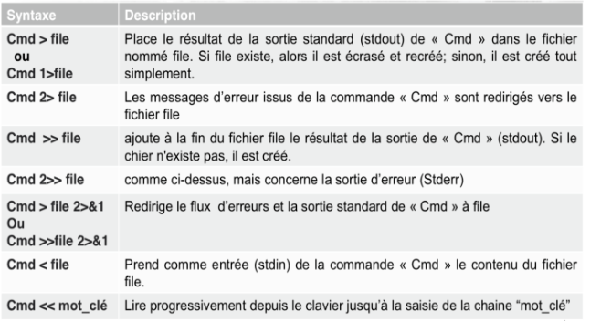
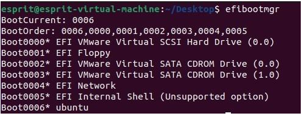
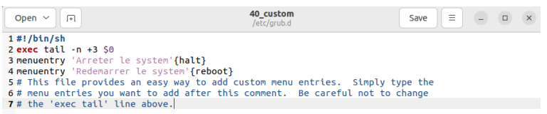

# esprit-cheatsheat

## Table of Contents

- [1A](#1a)
  - [Linux](#linux)
- [2A](#2a)
  - [BASH Scripting](#bash-scripting)
- [3A](#3a)
  - [Symfony](#symfony)
  - [UNIX](#UNIX)


# 1A

## Linux

<aside>
💡 quick thoughts :

</aside>

- linux is open source
- unix cost money , linux is free
- kernel(noyau) pour gestion des peripherique el les fichier
- les roles de OS: gestion memoir central , gestion les des processeurs ; its like the kernel

### files and directory commands :

- **cd**
    
    go to a specific dir 
    
    example:  
    
    ```bash
    cd /home/
    ```
    
    <aside>
    💡 cd . to go back
    
    </aside>
    
    <aside>
    💡 cd . . to go to the original dir
    
    </aside>
    
- **pwd**
    
    print the active dir (where you are)
    
- **ls**
    
    list all files/folders in the the active dir
    to print detailed ls `ls -ldai`
    
- **mkdir**
    
    make a directory
    
- **rmdir**
    
    remove a directory
    
- **gedit, vi, vim, nano**
    
    for editing files (use nano)
    
- **touch**
    
    for creating files
    
- **cat**
    
    for inspecitng  files
    
- **more/less**
    
    show long files page per page
    
- **cp**
    
    copy file and folders
    
    ```bash
    cp file1 file2
    cp home/file1 desktop/file2
    ```
    
- **mv**
    
    move files and folders
    
- **rm**
    
    remove files and folders
    
- **ln**
    
    creat links between files *there is 2 types of links soft and hard* 🍆
    
    - hard link
        
        ```bash
        ln -d original_file hard_link
        ```
        
    - soft links
        
        ```bash
        ln -s original_file soft_link
        ```
        

### users and groups commands :

<aside>
💡 **LOGIN** stands for acess id

</aside>

<aside>
💡 **UID** stands for user ID

</aside>

<aside>
💡 **GID** stands for Group ID

</aside>

- **useradd** for adiing a user
- **usemod** for editing a user
- **userdel** for deleting a user
- **passwd** for creating, editing, deleting passwords
- **groupadd** for adding a group
- **groupmod** for editing a group
- **groupdel** for deleting a group
- **su** *like sudo su* for login as root

### more commands :

<aside>
⚠️ hard shit here , and im too lazy

</aside>

- wc
    
    originally for word count but with the `-l` perimeter it count lines
    
- grep
    
    used for searching inside files
    
    - `grep -i mot_clef fichier` : Afficher toutes les lignes contenant « mot_clef »
    du fichier.
    - `grep -v mot_clef fichier` : Afficher les lignes ne contenant pas la «
    mot_clef » .
    - `grep -n mot_clef fichier` : Afficher chaque ligne contenant « mot_clef »
    numérotée.
    - `grep -r mot_clef rep` : rechercher d’une façon récursive dans tous les
    fichiers et sous-dossiers du rep.
- find
    
    used to search for files of folders
    
    - find répertoires [critères _de_séléction] [option_de_commande]
    - stuff
        
        
        
    - Pour trouver tous les fichiers de répertoire /work ayant plus de quatre liens:
        
        ```bash
        find /work -f -links +4 -print
        ```
        
    - Afficher tous les fichiers qui sont soit des répertoires soit dont le nom se
    termine par "ier", à partir du répertoire actif:
        
        ```bash
        find . \(-type d -o -name "*ier"\) -print
        ```
        
    - Afficher tous les répertoires placés sous le répertoire actif et commençant
    par une minuscule:
        
        ```bash
        find . -name "[a-z]*" -type d -print
        ```
        
    - Afficher tous les fichiers ayant une taille supérieur à 400Mo
        
        ```bash
        find . -type f -size +400M -print
        ```
        
        <aside>
        ⚠️ you **MUST** use \(  and \) if you use `-o` (OR operator) , *-a for AND*
        use -d for dir / use -f for file
        
        </aside>
        
- sort
    
    sort 🤯
    
    
    
- head, tail
    
    head print first 10 *for example* 
    
    tail print last 10 *for example*
    
    - -c : nb de caractère
    - -n: nb de lignes (défaut)
    
    ```bash
    head [option] <n> fichier
    tail [option] <n> fichier
    ```
    
    You can also use the **`head`**command to display the first few lines of the output of another command. For example, to display the first 5 lines of the output of the **`ls`**
    command, you can use the following command:
    
    ```bash
    ls | head -n 5
    ```
    
- cut
    
    cut 🤯
    
    
    
    **example :**
    
    ```bash
    //file name is data.txt
    
    name,age,gender
    John,30,male
    Jane,25,female
    Bob,35,male
    
    cut -d ',' -f 2-3 data.txt
    
    age,gender
    30,male
    25,female
    35,male
    ```
    

---

## RIGHTS!!!!!!

3 types of RIGHTS :

- w: for Write
- x: for execute
- r: for reading

<aside>
⚠️ **MEMORIZE THIS**

</aside>


we can edit writes of a folder, file using **chmod**

```bash
chmod 644 filename 
```

→ -rw-r—r— file name

- **chown** for editing owner (the user) of the file, folder

- **chgrp** for editing the group owner of the file, folder

```bash
chown new_owner fichier
```

```bash
chgrp new_grp fichier
```

<aside>
📁 default rights for a file is **666**
default rights for a folder is **777**

</aside>

*there is umask but who care 😛 (check prosit)*

---

## Filters and Tubes

examples :

```bash
cat /etc/home | wc -l
```

result is **79**




# 2A

## BASH Scripting

Voici un tableau récapitulatif des commandes de scripting Bash à apprendre, basé sur les chapitres fournis.

### Chapitre 2 : Langage de programmation Shell++++

| Commande          | Description                                                     |
| ----------------- | --------------------------------------------------------------- |
| `echo`            | Affiche un message à l'écran                                    |
| `read`            | Lit une entrée utilisateur                                      |
| `test`            | Évalue une expression conditionnelle                            |
| `[ ]`             | Synonyme de `test`                                              |
| `if ... then ...` | Structure conditionnelle simple                                 |
| `if ... else ...` | Structure conditionnelle avec alternative                       |
| `elif`            | Condition supplémentaire dans une structure `if`                |
| `case`            | Structure conditionnelle multi-choix                            |
| `for`             | Boucle pour itérer sur une liste d'éléments                     |
| `while`           | Boucle qui s'exécute tant qu'une condition est vraie            |
| `until`           | Boucle qui s'exécute jusqu'à ce qu'une condition devienne vraie |
| `break`           | Interrompt une boucle                                           |
| `continue`        | Passe à l'itération suivante d'une boucle                       |
| `&&`              | Opérateur logique ET                                            |

### Chapitre 3 : Conditions & Boucles en Shell

| Commande       | Description                                             |
| -------------- | ------------------------------------------------------- |
| `test -e`      | Vrai si le fichier existe                               |
| `test -f`      | Vrai si c'est un fichier ordinaire                      |
| `test -d`      | Vrai si c'est un répertoire                             |
| `test -L`      | Vrai si c'est un lien symbolique                        |
| `test -r`      | Vrai si le fichier est lisible                          |
| `test -x`      | Vrai si le fichier est exécutable                       |
| `test -w`      | Vrai si le fichier est inscriptible                     |
| `test -s`      | Vrai si le fichier existe et n'est pas vide             |
| `test ... -eq` | Teste l'égalité de deux nombres                         |
| `test ... -ne` | Teste si deux nombres sont différents                   |
| `test ... -lt` | Teste si un nombre est inférieur à un autre             |
| `test ... -le` | Teste si un nombre est inférieur ou égal à un autre     |
| `test ... -gt` | Teste si un nombre est supérieur à un autre             |
| `test ... -ge` | Teste si un nombre est supérieur ou égal à un autre     |
| `test -n`      | Vrai si la longueur de la chaîne est différente de zéro |
| `test -z`      | Vrai si la chaîne est de longueur zéro                  |
| `test ... =`   | Teste l'égalité de deux chaînes de caractères           |
| `test ... !=`  | Teste si deux chaînes de caractères sont différentes    |

### Chapitre 4 : Sous-programmes en Shell

| Commande           | Description                              |
| ------------------ | ---------------------------------------- |
| `()`               | Crée un sous-shell                       |
| `function name {}` | Déclare une fonction                     |
| `name () {}`       | Déclare une fonction (alternative)       |
| `return`           | Renvoie une valeur depuis une fonction   |
| `exit`             | Termine un script avec un code de sortie |
| `select`           | Affiche un menu de sélection             |
| `getopts`          | Analyse les options passées en argument  |

### Exemples de scripts

**Sous-shell:**

```bash
#!/bin/bash
(
  while [ 1 ]
  do
    echo "Sous-shell en cours d'exécution..."
  done
)

```

**Fonction avec paramètres:**

```bash
#!/bin/bash
usage() {
  echo "Usage: $0 filename"
  exit 1
}
file_exits() {
  test -f "$1" && return 0 || return 1
}
test $# -eq 0 && usage
if file_exits "$1"
then
  echo "File found"
else
  echo "File not found"
fi

```

**Menu avec `select`:**

```bash
#!/bin/bash
PS3="Votre choix :"
select item in "- Sauvegarde -" "- Restauration -" "- Fin -"
do
  echo "Vous avez choisi l'item $REPLY : $item"
  case $REPLY in
    1)
      echo "Lancement de la sauvegarde"
      ;;
    2)
      echo "Lancement de la restauration"
      ;;
    3)
      echo "Fin du script"
      exit 0
      ;;
    *)
      echo "Choix incorrect"
      ;;
  esac
done

```

**Analyse d'arguments avec `getopts`:**

```bash
#!/bin/bash
while getopts "ab:e:" option
do
  echo "getopts a trouvé l'option $option"
  case $option in
    a)
      echo "Exécution des commandes de l'option a"
      ;;
    b)
      echo "Exécution des commandes de l'option b"
      echo "Liste des arguments à traiter : $OPTARG"
      ;;
    e)
      echo "Exécution des commandes de l'option e"
      echo "Liste des arguments à traiter : $OPTARG"
      ;;
  esac
done
echo "Analyse des options terminée"
exit 0

```

Voici un exemple de script Bash qui utilise les concepts et commandes des chapitres 2 et 3, avec des explications détaillées :

### Exemple de Script Bash

### Objectif

Créer un script qui:

1. Vérifie l'existence d'un fichier.
2. Teste les permissions du fichier.
3. Affiche le contenu du fichier s'il est lisible.
4. Affiche un message d'erreur si le fichier n'est pas accessible ou n'existe pas.

### Script

```bash
#!/bin/bash

# Fonction pour afficher l'utilisation du script
usage() {
  echo "Usage: $0 <filename>"
  exit 1
}

# Vérifie si un fichier est accessible en lecture
check_file() {
  local file=$1
  if [ -e "$file" ]; then
    echo "Le fichier '$file' existe."
    if [ -r "$file" ]; then
      echo "Le fichier '$file' est lisible."
      echo "Contenu du fichier:"
      cat "$file"
    else
      echo "Le fichier '$file' n'est pas lisible."
    fi
  else
    echo "Le fichier '$file' n'existe pas."
  fi
}

# Vérifie si un argument est fourni
if [ $# -eq 0 ]; then
  usage
fi

# Appel de la fonction avec le fichier en paramètre
check_file "$1"

```

### Explications

### Ligne par ligne

1. `#!/bin/bash`
    - C'est la ligne de shebang qui indique que le script doit être exécuté avec l'interpréteur Bash.
2. `usage() { ... }`
    - Fonction `usage` qui affiche un message d'utilisation si aucun argument n'est fourni et termine le script avec un code de sortie 1.
3. `check_file() { ... }`
    - Fonction `check_file` qui prend un nom de fichier en paramètre et vérifie son existence et ses permissions.
4. `local file=$1`
    - Déclare une variable locale `file` qui reçoit le premier argument de la fonction.
5. `if [ -e "$file" ]; then`
    - Utilise la commande `test` (ou `[ ]`) pour vérifier si le fichier existe.
6. `echo "Le fichier '$file' existe."`
    - Affiche un message si le fichier existe.
7. `if [ -r "$file" ]; then`
    - Vérifie si le fichier est lisible.
8. `echo "Le fichier '$file' est lisible."`
    - Affiche un message si le fichier est lisible.
9. `echo "Contenu du fichier:"`
    - Affiche un en-tête avant le contenu du fichier.
10. `cat "$file"`
    - Affiche le contenu du fichier en utilisant la commande `cat`.
11. `else ... fi`
    - Bloc `else` qui s'exécute si le fichier n'est pas lisible, affichant un message d'erreur.
12. `else ... fi`
    - Bloc `else` qui s'exécute si le fichier n'existe pas, affichant un message d'erreur.
13. `if [ $# -eq 0 ]; then`
    - Vérifie si le nombre d'arguments passés au script est zéro.
14. `usage`
    - Appelle la fonction `usage` pour afficher le message d'utilisation et termine le script si aucun argument n'est fourni.
15. `check_file "$1"`
    - Appelle la fonction `check_file` avec le premier argument du script.

### Explication des Concepts Utilisés

- **Fonctions** : Les fonctions `usage` et `check_file` permettent de structurer le script et de réutiliser le code.
- **Conditions** :
    - `if [ -e "$file" ]; then` : Vérifie l'existence d'un fichier.
    - `if [ -r "$file" ]; then` : Vérifie si le fichier est lisible.
    - `if [ $# -eq 0 ]; then` : Vérifie si le nombre d'arguments est zéro.
- **Commandes de test** :
    - `e` : Teste si le fichier existe.
    - `r` : Teste si le fichier est lisible.
- **Affichage** :
    - `echo` : Utilisé pour afficher des messages.
    - `cat` : Utilisé pour afficher le contenu du fichier.

Ce script simple mais fonctionnel intègre plusieurs concepts clés des chapitres 2 et 3, tels que les tests de conditions, les structures `if`, et l'utilisation de fonctions pour organiser et modulariser le code.

### Exemple de Script Bash avec Chapitres 2, 3 et 4

### Objectif

Créer un script avancé qui:

1. Vérifie l'existence et les permissions d'un fichier.
2. Affiche le contenu du fichier s'il est lisible.
3. Utilise des fonctions pour modulariser le code.
4. Utilise des sous-shells et des menus interactifs pour offrir une meilleure expérience utilisateur.

### Script

```bash
#!/bin/bash

# Fonction pour afficher l'utilisation du script
usage() {
  echo "Usage: $0 <filename>"
  exit 1
}

# Fonction pour vérifier les permissions du fichier
check_file_permissions() {
  local file=$1
  if [ -e "$file" ]; then
    echo "Le fichier '$file' existe."
    if [ -r "$file" ]; then
      echo "Le fichier '$file' est lisible."
      return 0
    else
      echo "Le fichier '$file' n'est pas lisible."
      return 1
    fi
  else
    echo "Le fichier '$file' n'existe pas."
    return 2
  fi
}

# Fonction pour afficher le contenu du fichier
display_file_content() {
  local file=$1
  cat "$file"
}

# Fonction principale
main() {
  local file=$1
  check_file_permissions "$file"
  case $? in
    0)
      display_file_content "$file"
      ;;
    1)
      echo "Erreur : le fichier n'est pas lisible."
      ;;
    2)
      echo "Erreur : le fichier n'existe pas."
      ;;
  esac
}

# Vérifie si un argument est fourni
if [ $# -eq 0 ]; then
  usage
fi

# Appel de la fonction principale avec le fichier en paramètre
main "$1"

```

### Explications

### Ligne par ligne

1. `#!/bin/bash`
    - Ligne de shebang indiquant que le script doit être exécuté avec l'interpréteur Bash.
2. `usage() { ... }`
    - Fonction `usage` qui affiche un message d'utilisation si aucun argument n'est fourni et termine le script avec un code de sortie 1.
3. `check_file_permissions() { ... }`
    - Fonction `check_file_permissions` qui prend un nom de fichier en paramètre et vérifie son existence et ses permissions.
    - Utilise des commandes `test` pour vérifier l'existence (`e`) et la lisibilité (`r`) du fichier.
    - Retourne des codes de sortie différents pour indiquer l'état du fichier (existe et lisible, existe mais non lisible, n'existe pas).
4. `display_file_content() { ... }`
    - Fonction `display_file_content` qui prend un nom de fichier en paramètre et affiche son contenu en utilisant `cat`.
5. `main() { ... }`
    - Fonction `main` qui orchestre l'exécution du script.
    - Appelle `check_file_permissions` pour vérifier les permissions du fichier.
    - Utilise une structure conditionnelle `case` pour gérer les différents états du fichier en fonction du code de retour de `check_file_permissions`.
6. `if [ $# -eq 0 ]; then`
    - Vérifie si le nombre d'arguments passés au script est zéro.
7. `usage`
    - Appelle la fonction `usage` pour afficher le message d'utilisation et termine le script si aucun argument n'est fourni.
8. `main "$1"`
    - Appelle la fonction `main` avec le premier argument du script.

### Explication des Concepts Utilisés

- **Fonctions** :
    - `usage` : Fournit des instructions d'utilisation du script.
    - `check_file_permissions` : Vérifie les permissions du fichier et retourne un code de sortie.
    - `display_file_content` : Affiche le contenu du fichier.
    - `main` : Fonction principale qui orchestre l'exécution du script.
- **Conditions** :
    - `if [ -e "$file" ]; then` : Vérifie l'existence du fichier.
    - `if [ -r "$file" ]; then` : Vérifie si le fichier est lisible.
    - `case $? in` : Gère les différents états du fichier basés sur le code de retour de la fonction `check_file_permissions`.
- **Commandes de test** :
    - `e` : Teste si le fichier existe.
    - `r` : Teste si le fichier est lisible.
- **Sous-shell** :
    - Utilisation des parenthèses `()` pour exécuter des commandes dans un sous-shell si nécessaire (non illustré explicitement dans ce script mais mentionné comme concept).
- **Retour de fonction** :
    - `return 0` : Indique succès.
    - `return 1` : Indique échec de la lisibilité.
    - `return 2` : Indique que le fichier n'existe pas.

Ce script avancé utilise les concepts des chapitres 2, 3 et 4, intégrant des fonctions modulaires, des conditions complexes, et une structure logique pour gérer différents états du fichier.

# Revision ++

Voici un ensemble de syntaxes et de commandes courantes en Bash qui sont en relation avec les concepts couverts dans votre examen et les chapitres que vous avez partagés. Ces commandes incluent la gestion des variables, les structures conditionnelles, les boucles, les fonctions, et la manipulation des fichiers.

### Variables et Substitution

1. **Déclaration et affectation de variables**
    
    ```bash
    nom="John"
    age=30
    
    ```
    
2. **Accéder à la valeur d'une variable**
    
    ```bash
    echo $nom
    echo $age
    
    ```
    
3. **Substitution de commandes**
    
    ```bash
    current_date=$(date)
    echo "La date actuelle est : $current_date"
    
    ```
    
4. **Variable spéciale : longueur d'une chaîne**
    
    ```bash
    chaine="Bonjour"
    echo ${#chaine}  # Affiche 7
    
    tableau=(1 2 3 4)
    echo ${#tableau[@]}  # Affiche 4
    
    tableau=(1 2 3 4)
    echo ${#tableau[*]}  # Affiche 4
    ```
    

### Conditions

1. **Condition if**
    
    ```bash
    if [ $age -gt 18 ]; then
        echo "Vous êtes majeur."
    else
        echo "Vous êtes mineur."
    fi
    
    ```
    
2. **Condition elif**
    
    ```bash
    if [ $age -lt 13 ]; then
        echo "Enfant"
    elif [ $age -lt 20 ]; then
        echo "Adolescent"
    else
        echo "Adulte"
    fi
    
    ```
    
3. **Condition avec test d'existence de fichier**
    
    ```bash
    if [ -e fichier.txt ]; then
        echo "Le fichier existe."
    else
        echo "Le fichier n'existe pas."
    fi
    
    ```
    

### Boucles

1. **Boucle for**
    
    ```bash
    for i in {1..5}; do
        echo "Numéro $i"
    done
    
    ```
    
2. **Boucle while**
    
    ```bash
    compteur=1
    while [ $compteur -le 5 ]; do
        echo "Compteur : $compteur"
        ((compteur++))
    done
    
    ```
    
3. **Boucle until**
    
    ```bash
    compteur=1
    until [ $compteur -gt 5 ]; do
        echo "Compteur : $compteur"
        ((compteur++))
    done
    
    ```
    

### Fonctions

1. **Définir une fonction**
    
    ```bash
    ma_fonction() {
        echo "Ceci est une fonction."
    }
    
    ```
    
2. **Appeler une fonction**
    
    ```bash
    ma_fonction
    
    ```
    
3. **Fonction avec paramètres**
    
    ```bash
    addition() {
        echo $(($1 + $2))
    }
    addition 5 3  # Affiche 8
    
    ```
    

### Manipulation de fichiers

1. **Redirection de la sortie**
    
    ```bash
    echo "Hello, World!" > fichier.txt  # Écrase le contenu du fichier
    echo "Bonjour, Monde!" >> fichier.txt  # Ajoute au contenu du fichier
    
    ```
    
2. **Lire un fichier ligne par ligne**
    
    ```bash
    while IFS= read -r ligne; do
        echo "$ligne"
    done < fichier.txt
    
    ```
    
3. **Compter le nombre de lignes dans un fichier**
    
    ```bash
    nb_lignes=$(wc -l < fichier.txt)
    echo "Le fichier contient $nb_lignes lignes."
    
    ```
    

### Commandes utiles

1. **grep**
    
    ```bash
    grep "motif" fichier.txt  # Recherche de motif dans un fichier
    
    ```
    
2. **awk**
    
    ```bash
    awk '{print $1, $3}' fichier.txt  # Affiche la première et la troisième colonne
    
    ```
    
3. **sed**
    
    ```bash
    sed 's/ancien/nouveau/g' fichier.txt  # Remplace 'ancien' par 'nouveau'
    
    ```
    

### Variables spéciales

1. **$#**
    
    ```bash
    echo "Nombre de paramètres : $#"
    
    ```
    
2. **$@ et $**
    
    ```bash
    echo "Tous les paramètres : $@"
    echo "Tous les paramètres : $*"
    
    ```
    
3. **$?**
    
    ```bash
    commande
    echo "Le code de retour est : $?"
    
    ```
    

### Exercice supplémentaire

**Script pour manipuler les fichiers avec options**

```bash
#!/bin/bash

affiche_usage() {
    echo 'USAGE: GererFichier.sh : [-h] [-c] [-d] [-s] [-p] Fichier(s)..'
}

fn_tester() {
    if [ ! -e $1 ]; then
        echo "Le fichier est inexistant"
        return 1
    else
        return 0
    fi
}

fn_copier() {
    if fn_tester $1; then
        cp $1 /tmp/backup
    fi
}

fn_deplacer() {
    if fn_tester $1; then
        mv $1 /var/trash
    fi
}

fn_supprimer() {
    if fn_tester $1; then
        rm -i $1
    fi
}

fn_afficher_perm() {
    if fn_tester $1; then
        ls -l $1
    fi
}

if [ $# -lt 2 ]; then
    affiche_usage
    exit 1
fi

while getopts ":hcsdp" opt; do
    case $opt in
        h)
            affiche_usage
            ;;
        c)
            fn_copier $2
            ;;
        s)
            fn_supprimer $2
            ;;
        d)
            fn_deplacer $2
            ;;
        p)
            fn_afficher_perm $2
            ;;
        \\?)
            echo "Option invalide: -$OPTARG" >&2
            affiche_usage
            exit 1
            ;;
    esac
done

```

### Commande pour déplacer et afficher les permissions

```bash
./GererFichier.sh -dp script1.sh

```

Ces commandes et concepts couvrent un large éventail des fonctions courantes et sont essentielles pour bien comprendre et maîtriser le scripting Bash.

En Bash, les symboles `#`, `$#`, et `$1` jouent des rôles spécifiques et très importants, particulièrement dans la gestion des arguments passés aux scripts. Voici une explication détaillée de chacun, avec des exemples d'utilisation :-

### `#`

Le symbole `#` est utilisé pour deux fins principales en Bash :

1. **Commentaire** :
    - Tout ce qui suit un `#` sur une ligne est ignoré par l'interpréteur Bash. Cela permet d'ajouter des commentaires pour expliquer le code.
    
    ```bash
    # Ceci est un commentaire
    echo "Bonjour, Monde!"  # Ceci est aussi un commentaire
    
    ```
    
2. **Longueur d'une chaîne ou d'un tableau** :
    - Devant une variable, `#` peut être utilisé pour obtenir la longueur d'une chaîne ou le nombre d'éléments dans un tableau.
    
    ```bash
    chaine="Bonjour"
    echo ${#chaine}  # Affiche 7
    
    tableau=(1 2 3 4)
    echo ${#tableau[@]}  # Affiche 4
    
    ```
    

### `$#`

Le symbole `$#` est une variable spéciale en Bash qui représente le nombre d'arguments passés au script ou à une fonction.

**Utilisation** :

- Vérifier si le bon nombre d'arguments a été passé au script.
- Utiliser dans des boucles pour traiter chaque argument.

**Exemple** :

```bash
#!/bin/bash

if [ $# -ne 2 ]; then
    echo "Usage: $0 param1 param2"
    exit 1
fi

echo "Le premier argument est : $1"
echo "Le deuxième argument est : $2"

```

Dans cet exemple, si le script ne reçoit pas exactement deux arguments, il affiche un message d'utilisation et quitte.

### `$1`, `$2`, ... `$N`

Les symboles `$1`, `$2`, etc., représentent les arguments positionnels passés au script ou à une fonction, où `$1` est le premier argument, `$2` le deuxième, et ainsi de suite.

**Utilisation** :

- Accéder aux arguments individuels passés au script.
- Utiliser dans des fonctions pour traiter des paramètres.

**Exemple** :

```bash
#!/bin/bash

if [ $# -lt 2 ]; then
    echo "Usage: $0 param1 param2"
    exit 1
fi

param1=$1
param2=$2

echo "Le premier argument est : $param1"
echo "Le deuxième argument est : $param2"

```

### Exemple de Script Complet

Voici un script qui utilise `#`, `$#`, `$1`, et `$2` pour vérifier les arguments et effectuer une action simple :

```bash
#!/bin/bash

# Script pour copier un fichier s'il y a deux arguments

# Vérification du nombre d'arguments
if [ $# -ne 2 ]; then
    echo "Usage: $0 source_file destination_file"
    exit 1
fi

# Affecter les arguments à des variables
source_file=$1
destination_file=$2

# Vérifier si le fichier source existe
if [ ! -e "$source_file" ]; then
    echo "Le fichier source $source_file n'existe pas."
    exit 1
fi

# Copier le fichier
cp "$source_file" "$destination_file"
echo "Fichier copié de $source_file à $destination_file"

```

### Résumé des Utilisations

- **`#`** :
    - Utilisé pour les commentaires.
    - Préfixe pour obtenir la longueur d'une chaîne ou le nombre d'éléments dans un tableau.
- **`$#`** :
    - Indique le nombre d'arguments passés au script ou à une fonction.
    - Utilisé pour valider le nombre d'arguments avant de procéder.
- **`$1`, `$2`, ... `$N`** :
    - Représentent les arguments positionnels passés au script ou à une fonction.
    - Utilisés pour accéder et manipuler les arguments individuels.

Ces symboles sont essentiels pour la manipulation des arguments et le contrôle du flux dans les scripts Bash.

# ///////////////////////////////////////////////////

# Voici un exemple de devoir

### Devoir : Système et Scripting

### Exercice 1 : QCM (5 points)

Choisissez la bonne réponse pour chaque question suivante.

1. Comment assigner la sortie d'une commande à une variable en Shell ?
A. `variable = $(commande)`
B. `variable := $(commande)`
C. `variable <- $(commande)`
D. `variable = (commande)`
2. Quelle commande permet de créer un lien symbolique en Shell ?
A. `ln -s`
B. `link`
C. `symlink`
D. `ln -sym`
3. Comment compter le nombre de fichiers dans un répertoire en utilisant une commande Shell ?
A. `count *`
B. `ls | wc -l`
C. `find . -type f | count`
D. `ls -f`
4. Quelle commande affiche le chemin absolu du répertoire courant ?
A. `pwd`
B. `path`
C. `curdir`
D. `dir`
5. Comment vérifier si un répertoire existe en Shell ?
A. `if [ -d répertoire ]`
B. `if [ -f répertoire ]`
C. `if [ -e répertoire ]`
D. `if [ -x répertoire ]`

### Exercice 2 : Script Shell de base (5 points)

Écrivez un script Shell nommé `info_fichier.sh` qui prend un nom de fichier en argument et effectue les actions suivantes :

1. Vérifie si le fichier existe. Si le fichier n'existe pas, affiche un message d'erreur et quitte le script.
2. Affiche le nombre de lignes, de mots et de caractères dans le fichier.
3. Affiche les cinq premières lignes du fichier.
4. Affiche les permissions du fichier.

### Exercice 3 : Script Shell avancé (10 points)

Écrivez un script Shell nommé `manage_users.sh` pour gérer les utilisateurs sur un système Linux. Le script doit proposer les options suivantes :

1. `a username` : Ajouter un utilisateur.
2. `d username` : Supprimer un utilisateur.
3. `l` : Lister tous les utilisateurs du système.
4. `h` : Afficher l'aide du script.

### Correction

### Exercice 1 : QCM

1. A. `variable = $(commande)`
2. A. `ln -s`
3. B. `ls | wc -l`
4. A. `pwd`
5. A. `if [ -d répertoire ]`

### Exercice 2 : Script Shell de base

Voici un exemple de script `info_fichier.sh` :

```bash
#!/bin/bash

# Vérifier si un argument est passé
if [ $# -ne 1 ]; then
    echo "Usage: $0 <nom_du_fichier>"
    exit 1
fi

# Assigner le premier argument à une variable
fichier=$1

# Vérifier si le fichier existe
if [ ! -e "$fichier" ]; then
    echo "Erreur: Le fichier '$fichier' n'existe pas."
    exit 1
fi

# Afficher le nombre de lignes, de mots et de caractères
echo "Nombre de lignes, mots et caractères dans '$fichier':"
wc "$fichier"

# Afficher les cinq premières lignes
echo "Les cinq premières lignes de '$fichier' :"
head -n 5 "$fichier"

# Afficher les permissions du fichier
echo "Permissions de '$fichier' :"
ls -l "$fichier"

```

### Exercice 3 : Script Shell avancé

Voici un exemple de script `manage_users.sh` :

```bash
#!/bin/bash

# Fonction pour afficher l'usage du script
affiche_usage() {
    echo "USAGE: $0 [-a username] [-d username] [-l] [-h]"
}

# Fonction pour ajouter un utilisateur
ajouter_utilisateur() {
    sudo useradd $1
    if [ $? -eq 0 ]; then
        echo "Utilisateur $1 ajouté avec succès."
    else
        echo "Erreur lors de l'ajout de l'utilisateur $1."
    fi
}

# Fonction pour supprimer un utilisateur
supprimer_utilisateur() {
    sudo userdel $1
    if [ $? -eq 0 ]; then
        echo "Utilisateur $1 supprimé avec succès."
    else
        echo "Erreur lors de la suppression de l'utilisateur $1."
    fi
}

# Fonction pour lister tous les utilisateurs
lister_utilisateurs() {
    cut -d: -f1 /etc/passwd
}

# Vérifier si au moins une option est passée
if [ $# -eq 0 ]; then
    affiche_usage
    exit 1
fi

# Analyser les options passées en argument
while getopts "a:d:lh" option; do
    case $option in
        a) ajouter_utilisateur $OPTARG;;
        d) supprimer_utilisateur $OPTARG;;
        l) lister_utilisateurs;;
        h) affiche_usage;;
        *) affiche_usage;;
    esac
done

```

 

```bash
#!/bin/bash

echo "Welcome to the System Info Script!"

echo "Current user: $(whoami)"
echo "Current hostname: $(hostname)"
echo "Current working directory: $(pwd)"
echo "Current date and time: $(date)"
echo "System uptime: $(uptime -p)"
echo "Operating system: $(uname -s)"
echo "Kernel version: $(uname -r)"

echo "Available disk space:"
df -h /

echo "Memory usage:"
free -h

```

This script uses several commands to display system information:

- `whoami`: Displays the current user's username
- `hostname`: Shows the system's hostname
- `pwd`: Prints the current working directory
- `date`: Displays the current date and time
- `uptime -p`: Shows how long the system has been running
- `uname -s` and `uname -r`: Display the operating system name and kernel version
- `df -h /`: Shows available disk space on the root filesystem
- `free -h`: Displays memory usage information

You can save this script to a file (e.g., `system_info.sh`), make it executable with `chmod +x system_info.sh`, and then run it with `./system_info.sh` to see various pieces of system information.

# 3A

## Symfony

install symfony

```sh
composer create-project symfony/skeleton:6.4.* Template
composer require webapp
symfony server:start 
symfony serve
```

make controller

```sh
symfony console make:controller
```

setup database

change .env file:
`DATABASE_URL="mysql://root:@127.0.0.1:3306/DB_name"`

```sh
Symfony console doctrine:database:create
```

make entity

```sh
symfony console make:entity
```

migration

```sh
symfony console make:migration
symfony console doctrine:migrations:migrate
```

## UNIX

Répertorier les entrées du gestionnaire de démarrage EFI
`efibootmgr`



| Commande                                                                        | Description                                                                 |
| ------------------------------------------------------------------------------- | --------------------------------------------------------------------------- |
| `efibootmgr -v`                                                                 | Displays detailed information about the current boot manager configuration. |
| `efibootmgr -o`                                                                 | Sets the boot order.                                                        |
| `sudo efibootmgr -B -b <boot_num>`                                              | Deletes a boot entry specified by `<boot_num>`.                             |
| `sudo efibootmgr -c -d /dev/sda -p 1 -L "Ubuntu20" -l '\EFI\ubuntu\bootx64.ef'` | Creates a new boot entry for Ubuntu. -c create -d disk -l name -l location  |
| `sudo efibootmgr -n <numeroEntrée>`                                             | Sets the next boot entry to `<numeroEntrée>`.                               |
| `efibootmgr -t <délai>`                                                         | Sets the boot manager timeout to `<délai>`.                                 |

## GRUB Configuration

The file: `/etc/default/grub` is the main configuration file for GRUB2. It contains default settings that influence the overall behavior of the bootloader.

### Key Parameters

- **`GRUB_DEFAULT`**
  - Defines the default entry in the GRUB boot menu.
  - A numeric value corresponds to the position in the menu, while `"saved"` boots the last used system.

- **`GRUB_TIMEOUT_STYLE`**
  - Determines the display style of the menu: it can be visible, hidden, or hidden with a timeout.

- **`GRUB_TIMEOUT`**
  - Specifies the number of seconds before automatically booting the default OS.

- **`GRUB_DISTRIBUTOR`**
  - Customizes the title displayed in the GRUB menu, based on the distribution by default.

- **`GRUB_CMDLINE_LINUX_DEFAULT`**
  - Configures the default kernel boot options, such as `"splash"` for a graphical screen or `"quiet"` to reduce messages.

Remarque : Suite à chaque modification du fichier /etc/default/grub, on doit exécuter la
commande `update-grub` pour mettre à jour le fichier de configuration /boot/grub/grub.cfg
puis redémarrer.

## example of config code

```bash
modifer_efimenu(){
echo "1.entre le nombre de boot que vous voulez supprimer"
echo "2.entrer le nombre que vous voulez ajouter"
echo "3.si vous voulez changer le ordre des boot "
echo "4.boot next"
echo "5.afficher le menu avec son shema"
echo"0. quittez"
read -p "entrer le choix" choix
case $choix in 
1) read -p "entre le nombre de boot que vous voulez supprimer" a
 sudo efibootmgr -B -b $a
2) read -p "Entrez le nombre de boot que vous voulez ajouter : " nombre
read -p "Entrez le nom du boot : " nom 
   sudo efibootmgr -c -d /dev/sda -p $nombre -L "$nom" -l '\EFI\ubuntu\bootx64.efi'
3) read -p "entre lordre" a
   sudo efibootmgr -o $a 
4) read -p "entrer le numero de boot" n
   sudo efibootmgr -n $n
5) sudo efibootmgr -v
0) exit 0
*) echo "choix invalide"
esac 
}
```

